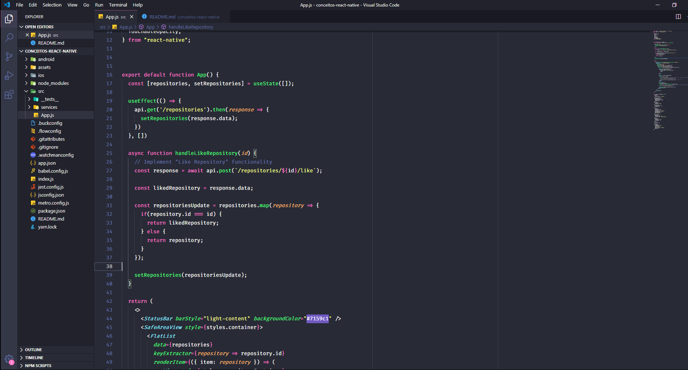

<h3 align="center">
  Desafio 04: Conceitos do React Native
</h3>

  <a href="#rocket-sobre-o-desafio">About the challenge</a>&nbsp;&nbsp;&nbsp;|&nbsp;&nbsp;&nbsp;

## :rocket: About the challenge

In this challenge, we created an application to store repositories in my portfolio. 

We use the concepts of React Native as a basis to create our application mobile.

  

Made by Janderson Pizzially Vilas Boas (https://www.linkedin.com/in/jandersonvilasboas/)